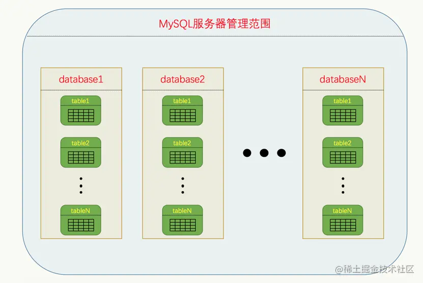

# 第4章、数据库的基本操作

标签： MySQL是怎样使用的新版

------

`MySQL`中把一些表的集合称为一个`数据库`，`MySQL`服务器管理着若干个数据库，每个数据库下都可以有若干个表，画个图就是这样：



## 展示数据库

在我们刚刚安装好`MySQL`的时候，它已经内建了许多数据库和表了，我们可以使用下边这个命令来看一下都有哪些数据库：

```ini
ini
复制代码SHOW DATABASES;
```

我自己的电脑上安装的`MySQL`版本是`5.7.22`，看一下在这个版本里内建了哪些数据库：

```sql
sql复制代码mysql> SHOW DATABASES;
+--------------------+
| Database           |
+--------------------+
| information_schema |
| mysql              |
| performance_schema |
| sys                |
+--------------------+
4 rows in set (0.01 sec)

mysql>
```

可以看到，这一版本的`MySQL`已经为我们内建了4个数据库，这些数据库都是给`MySQL`自己内部使用的，如果我们想使用`MySQL`存放自己的数据，首先需要创建一个属于自己的数据库。

## 创建数据库

创建数据库的语法贼简单：

```ini
ini
复制代码CREATE DATABASE 数据库名;
```

来实际操作一下：

```shell
shell复制代码mysql> CREATE DATABASE xiaohaizi;
Query OK, 1 row affected (0.00 sec)

mysql>
```

我把我的名字`xiaohaizi`作为了数据库名称，语句写完之后按下回车键，然后提示了一个`Query OK, 1 row affected (0.00 sec)`说明数据库创建成功了。然后我们再用`SHOW DATABASES`的命令查看一下现在有哪些数据库：

```sql
sql复制代码mysql> SHOW DATABASES;
+--------------------+
| Database           |
+--------------------+
| information_schema |
| mysql              |
| performance_schema |
| sys                |
| xiaohaizi          |
+--------------------+
5 rows in set (0.00 sec)

mysql>
```

看到我们自己创建的数据库`xiaohaizi`就已经在列表里了。

### IF NOT EXISTS

我们在一个数据库已经存在的情况下再使用`CREATE DATABASE`去创建这个数据库会产生错误：

```arduino
arduino复制代码mysql> CREATE DATABASE xiaohaizi;
ERROR 1007 (HY000): Can't create database 'xiaohaizi'; database exists
mysql>
```

执行结果提示了一个`ERROR`，意思是数据库`xiaohaizi`已经存在！所以如果我们并不清楚数据库是否存在，可以使用下边的语句来创建数据库：

```sql
sql
复制代码CREATE DATABASE IF NOT EXISTS 数据库名;
```

这个命令的意思是如果指定的数据库不存在的话就创建它，否则什么都不做。我们试一试：

```sql
sql复制代码mysql> CREATE DATABASE IF NOT EXISTS xiaohaizi;
Query OK, 1 row affected, 1 warning (0.00 sec)

mysql>
```

可以看到语句执行成功了，提示的`ERROR`也没有了，只是结果中有1个`warning`，这个`warning`只是`MySQL`善意的提醒我们数据库`xiaohaizi`已存在而已。

```!
!复制代码小贴士：

warning的等级比error的等级低，如果执行某个语句后提示了warning，只是属于一个善意的提示，不影响语句的执行，而提示了error之后说明语句压根儿无法执行。
```

## 切换当前数据库

对于每一个连接到`MySQL`服务器的客户端，都有一个`当前数据库`的概念（也可以称之为`默认数据库`），我们创建的表默认都会被放到当前数据库中，切换当前数据库的命令也贼简单：

```ini
ini
复制代码USE 数据库名称;
```

在介绍表的基本操作之前，我们应该把当前数据库切换到刚刚创建的数据库`xiaohaizi`上：

```shell
shell复制代码mysql> USE xiaohaizi;
Database changed
mysql>
```

看到显示了`Database changed`说明当前数据库已经切换成功了。需要注意的是，在退出当前客户端之后，也就是你输入了`exit`或者`quit`命令之后或者直接把当前的黑框框页面关掉，当你再次调用`mysql -h 主机名 -u 用户名 -p密码`的时候，相当于重新开启了一个客户端，需要重新调用`USE 数据库名称`的语句来选择一下当前数据库。

其实我们在新启动客户端连接服务器时就可以指定连接建立成功后客户端的当前数据库，只要把数据库名称写在启动客户端的命令`mysql -h 主机名 -u 用户名 -p密码 `后边就好，如下：

```
复制代码mysql -h localhost -u root -p123456 xiaohaizi
```

## 删除数据库

如果我们觉得某个数据库没用了，还可以把它删掉，语法如下：

```ini
ini
复制代码DROP DATABASE 数据库名;
```

在真实的工作环境里，在删除数据库之前你需要先拿体温计量量是不是发高烧了，然后再找至少两个人核实一下自己是不是发烧了，然后你才敢执行删除数据库的命令。删除数据库意味着里边的表就都被删除了，也就意味着你的数据都没了，所以是个极其危险的操作，使用时需要极其谨慎。不过我们这是学习环境，而且刚刚创建了`xiaohaizi`数据库，什么表都没往里头放，删了就删了吧：

```shell
shell复制代码mysql> DROP DATABASE xiaohaizi;
Query OK, 0 rows affected (0.01 sec)

mysql>
```

然后看一下现在还有哪些数据库：

```sql
sql复制代码mysql> SHOW DATABASES;
+--------------------+
| Database           |
+--------------------+
| information_schema |
| mysql              |
| performance_schema |
| sys                |
+--------------------+
4 rows in set (0.01 sec)

mysql>
```

可以看到我们前边创建的`xiaohaizi`数据库就没有啦。

### IF EXISTS

如果某个数据库并不存在，我们仍旧调用`DROP DATABASE`语句去删除它，不过会报错的：

```rust
rust复制代码mysql> DROP DATABASE xiaohaizi;
ERROR 1008 (HY000): Can't drop database 'xiaohaizi'; database doesn't exist
mysql>
```

如果想避免这种报错，可以使用这种形式的语句来删除数据库：

```sql
sql
复制代码DROP DATABASE IF EXISTS 数据库名;
```

再次删除一下`xiaohaizi`：

```sql
sql复制代码mysql> DROP DATABASE IF EXISTS xiaohaizi;
Query OK, 0 rows affected, 1 warning (0.00 sec)

mysql>
```

这回就不会报错啦！演示完删除数据库的流程之后还是把`xiaohaizi`数据库创建出来并且切换到当前数据库吧，毕竟我们之后还要在这个数据库里创建各种表呢～