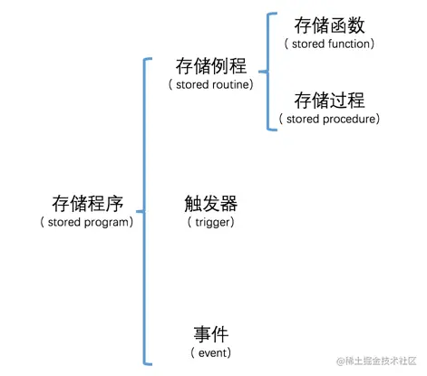

# 第16章、自定义变量和语句结束分隔符

标签： MySQL是怎样使用的新版

------

## 存储程序

有时候为了完成一个常用的功能需要执行许多条语句，每次都在客户端里一条一条的去输入这么多语句是很烦的。设计`MySQL`的大叔非常贴心的给我们提供了一种称之为`存储程序`的东东，这个所谓的`存储程序`可以封装一些语句，然后给用户提供一种简单的方式来调用这个存储程序，从而间接地执行这些语句。根据调用方式的不同，我们可以把`存储程序`分为`存储例程`、`触发器`和`事件`这几种类型。其中，`存储例程`又可以被细分为`存储函数`和`存储过程`。我们画个图表示一下：



别看出现了很多陌生的概念，别怕，我们后边会各个击破的。不过在正式介绍`存储程序`之前，我们需要先了解一下`MySQL`中的自定义变量和语句结束分隔符的概念。

## 自定义变量简介

生活中我们经常会遇到一些固定不变的值，比如数字`100`、字符串`'你好呀'`，我们把这些值固定不变的东东称之为`常量`。可是有时候为了方便，我们会使用某一个符号来代表一个值，它代表的值是可以变化的。比方说我们规定符号`a`代表数字`1`，之后我们又可以让符号`a`代表数字`2`，我们把这种值可以发生变化的东东称之为`变量`，其中符号`a`就称为这个变量的`变量名`。在`MySQL`中，我们可以通过`SET`语句来自定义一些我们自己的变量，比方说这样：

```ini
ini复制代码mysql> SET @a = 1;
Query OK, 0 rows affected (0.00 sec)

mysql>
```

上边的语句就表明我们定义了一个称之为`a`的变量，并且把整数`1`赋值给了这个变量。不过大家需要注意一下，设计MySQL的大叔规定，在我们的自定义变量前边必须加一个`@`符号（虽然有点儿怪，但这就是人家规定的，大家遵守就好了）。

如果我们之后想查看这个变量的值的话，使用`SELECT`语句就好了，不过仍然需要在变量名称前加一个`@`符号：

```sql
sql复制代码mysql> SELECT @a;
+------+
| @a   |
+------+
|    1 |
+------+
1 row in set (0.00 sec)

mysql>
```

同一个变量也可以存储存储不同类型的值，比方说我们再把一个字符串值赋值给变量`a`：

```sql
sql复制代码mysql> SET @a = '哈哈哈';
Query OK, 0 rows affected (0.01 sec)

mysql> SELECT @a;
+-----------+
| @a        |
+-----------+
| 哈哈哈    |
+-----------+
1 row in set (0.00 sec)

mysql>
```

除了把一个常量赋值给一个变量以外，我们还可以把一个变量赋值给另一个变量：

```sql
sql复制代码mysql> SET @b = @a;
Query OK, 0 rows affected (0.00 sec)

mysql> select @b;
+-----------+
| @b        |
+-----------+
| 哈哈哈    |
+-----------+
1 row in set (0.00 sec)

mysql>
```

这样变量`a`和`b`就有了相同的值`'哇哈哈'`！

我们还可以将某个查询的结果赋值给一个变量，前提是这个查询的结果只有一个值：

```sql
sql复制代码mysql> SET @a = (SELECT m1 FROM t1 LIMIT 1);
Query OK, 0 rows affected (0.00 sec)

mysql>
```

还可以用另一种形式的语句来将查询的结果赋值给一个变量：

```sql
sql复制代码mysql> SELECT n1 FROM t1 LIMIT 1 INTO @b;
Query OK, 1 row affected (0.00 sec)

mysql>
```

因为语句`SELECT m1 FROM t1 LIMIT 1`和`SELECT n1 FROM t1 LIMIT 1`的查询结果都只有一个值，所以它们可以直接赋值给变量`a`或者`b`。我们查看一下这两个变量的值：

```sql
sql复制代码mysql> SELECT @a, @b;
+------+------+
| @a   | @b   |
+------+------+
|    1 | a    |
+------+------+
1 row in set (0.00 sec)

mysql>
```

如果我们的查询结果是一条记录，该记录中有多个列的值的话，我们想把这几个值分别赋值到不同的变量中，只能使用`INTO`语句了：

```sql
sql复制代码mysql> SELECT m1, n1 FROM t1 LIMIT 1 INTO @a, @b;
Query OK, 1 row affected (0.00 sec)

mysql>
```

这条查询语句的结果集中只包含一条记录，我们把这条记录的`m1`列的值赋值到了变量`a`中，`n1`列的值赋值到了变量`b`中。

## 语句结束分隔符

在`MySQL`客户端的交互界面处，当我们完成键盘输入并按下回车键时，`MySQL`客户端会检测我们输入的内容中是否包含`;`、`\g`或者`\G`这三个符号之一，如果有的话，会把我们输入的内容发送到服务器。这样一来，如果我们想一次性给服务器发送多条的话，就需要把这些语句写到一行中，比如这样：

```sql
sql复制代码mysql> SELECT * FROM t1 LIMIT 1;SELECT * FROM t2 LIMIT 1;SELECT * FROM t3 LIMIT 1;
+------+------+
| m1   | n1   |
+------+------+
|    1 | a    |
+------+------+
1 row in set (0.00 sec)

+------+------+
| m2   | n2   |
+------+------+
|    2 | b    |
+------+------+
1 row in set (0.00 sec)

+------+------+
| m3   | n3   |
+------+------+
|    3 | c    |
+------+------+
1 row in set (0.00 sec)

mysql>
```

造成这一不便的原因在于，`MySQL`客户端检测输入结束用的符号和分隔各个语句的符号是一样的！其实我们也可以用`delimiter`命令来自定义`MySQL`的检测语句输入结束的符号，也就是所谓的`语句结束分隔符`，比如这样：

```sql
sql复制代码mysql> delimiter $
mysql> SELECT * FROM t1 LIMIT 1;
    -> SELECT * FROM t2 LIMIT 1;
    -> SELECT * FROM t3 LIMIT 1;
    -> $
+------+------+
| m1   | n1   |
+------+------+
|    1 | a    |
+------+------+
1 row in set (0.00 sec)

+------+------+
| m2   | n2   |
+------+------+
|    2 | b    |
+------+------+
1 row in set (0.00 sec)

+------+------+
| m3   | n3   |
+------+------+
|    3 | c    |
+------+------+
1 row in set (0.00 sec)

mysql>
```

`delimiter $`命令意味着修改语句结束分隔符为`$`，也就是说之后`MySQL`客户端检测用户语句输入结束的符号为`$`。上边例子中我们虽然连续输入了3个以分号`;`结尾的查询语句并且按了回车键，但是输入的内容并没有被提交，直到敲下`$`符号并回车，`MySQL`客户端才会将我们输入的内容提交到服务器，此时我们输入的内容里已经包含了3个独立的查询语句了，所以返回了3个结果集。

我们也可以将`语句结束分隔符`重新定义为`$`以外的其他包含单个或多个字符的字符串，比方说这样：

```sql
sql复制代码mysql> delimiter EOF
mysql> SELECT * FROM t1 LIMIT 1;
    -> SELECT * FROM t2 LIMIT 1;
    -> SELECT * FROM t3 LIMIT 1;
    -> EOF
+------+------+
| m1   | n1   |
+------+------+
|    1 | a    |
+------+------+
1 row in set (0.00 sec)

+------+------+
| m2   | n2   |
+------+------+
|    2 | b    |
+------+------+
1 row in set (0.00 sec)

+------+------+
| m3   | n3   |
+------+------+
|    3 | c    |
+------+------+
1 row in set (0.00 sec)

mysql>
```

我们这里采用了`EOF`作为`MySQL`客户端检测输入结束的符号，是不是很easy啊！当然，这个只是为了方便我们一次性输入多个语句，在输入完成之后最好还是改回我们常用的分号`;`吧：

```ini
ini
复制代码mysql> delimiter ;
!复制代码小贴士：

我们应该避免使用反斜杠（\）字符作为语句结束分隔符，因为这是MySQL的转义字符。
```