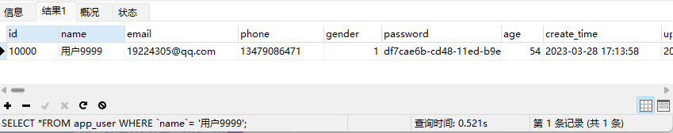
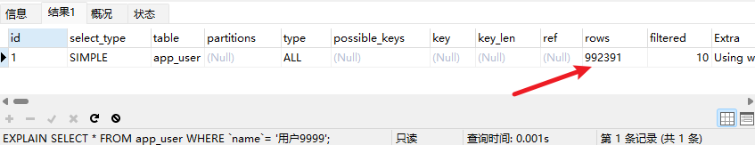
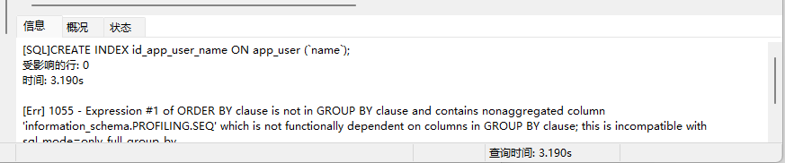
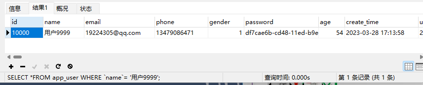
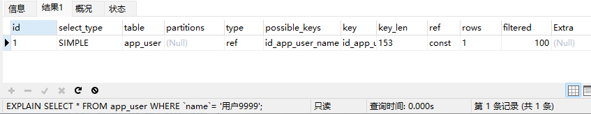

# 1、命令行连接

所有的语句都用分号 `; ` 结尾

```
mysql -u root -p    -- 连接数据库

show databases;     -- 查看所有数据库

use school;         -- 切换数据库 use 数据库名

show tables;   -- 查看所有表

describe student;   -- 显示表中的所有信息

show create table student\G;   -- 显示创建表的详细信息

create database student;  -- 创建一个数据库

alter table 旧表名 rename 新表名;    -- 修改表名

alter table 表名 change 旧字段名 新字段名 新数据类型;   -- 修改表的字段名

alter table 表名 modify 字段名 数据类型;       -- 修改表中字段数据类型

ALTER TABLE 表名 ADD 新字段名 数据类型 [约束条件] [FIRST|AFTER] 已存在字段名;   -- 添加字段

alter table 表名 drop 字段名;    -- 删除字段

drop table if exists 表名   -- 删除数据表

alter table 表名 modify 字段1 数据类型 [first|alter] 字段2;   -- 修改表中字段的位置

exit;      -- 退出连接

-- 单行注释 （SQL本身的注释）
/* */ 多行注释 
```

`DDL` 数据库定义语言

`DML` 数据库操作语言

`DQL` 数据库查询语言

`DCL` 数据库控制语言

# 2、操作数据库

操作数据库 > 操作数据库中的表 > 操作数据库中表的数据

`MySQL`关键字不区分大小写

## 2.1操作数据库

1、创建数据库

```
create database if not exists `student`;
```

2、删除数据库

```
drop database if exists `student`;
```

3、使用数据库

```
use `student`;
```

4、查看所有的数据库

```
show databases;
```

## 2.2数据库的列类型

> 数值

- tinyint  十分小的数据 1字节
- smallint  较小的数据  2字节
- mediumint  中等大小的数据   3字节
- int          标准的整数   4字节
- bigint    较大的数据     8字节
- float      浮点数       4字节
- double     浮点数    8字节
- decimal      字符串类型的浮点数 精度高

> 字符串

- char    字符串固定大小的  0~255
- varchar    可变字符串  0~65535    常用的  对应String
- tinytext    微型文本       2^8 - 1
- text         文本串           2^16 - 1   保存大文本     

> 时间日期

- date      YYYY-MM-DD   日期格式
- time      HH：mm：ss  时间格式
- datetime    YYYY-MM-DD HH：mm：ss 最常用的
- timestamp  时间戳 1970.1.1到现在的毫秒数
- year   年份表示

> null

- 没有值，未知

不要用null进行运算！

## 2.3数据库的字段属性

Unsigned：无符号的整数，声明了该列不能为负数

zerofill：0填充的，不足的位数使用0填充

自增：自动在上一条记录的基础上加一，通常用来设计唯一的主键，必须是整数类型

非空（NULL not null）：假设加设置为not null，如果不填写值，就会报错

​                                        NULL：如果不填写值，默认就是null！

默认：设置默认的值

## 2.4练习

```
目标：创建要给school数据库
创建学生表（列，字段）：使用sql创建
学号int，登录密码varchar（20） 姓名varchar（），性别varchar（2），出生日期（datetime）家庭住址，email
```

```mysql 
CREATE TABLE
IF NOT EXISTS `student` (
	`id` INT (4) NOT NULL auto_increment COMMENT '学号',
	`name` VARCHAR (30) NOT NULL DEFAULT '匿名' COMMENT '姓名',
	`pwd` VARCHAR (20) NOT NULL DEFAULT '123456' COMMENT '密码',
	`sex` VARCHAR (2) NOT NULL DEFAULT '女' COMMENT '性别',
	`birthday` datetime DEFAULT NULL COMMENT '出生日期',
	`address` VARCHAR (100) DEFAULT NULL COMMENT '家庭住址',
	`email` VARCHAR (50) DEFAULT NULL COMMENT '邮箱' ,
  primary key (`id`)
) ENGINE = INNODB DEFAULT charset = utf8
```

# 3、关于数据库引擎

## 3.1、`INNODB`   默认

## 3.2、`MYISAM`   早些年使用

|            | INNODB               | MYISAM |
| ---------- | -------------------- | ------ |
| 事务支持   | 支持                 | 不支持 |
| 数据行锁定 | 支持                 | 不支持 |
| 外键约束   | 支持                 | 不支持 |
| 全文索引   | 不支持               | 支持   |
| 表空间大小 | 较大，约为MYISAM两倍 | 较小   |

常规使用操作：

- MYISAM   节约空间，速度较快
- INNODB   安全性高，事务的处理，多表多用户操作

> 在物理空间存在的位置

所有的数据文件都在`data`文件下，本质还是文件的存储！

MySQL引擎在物理文件上的区别

- INNODB 在数据表中只有一个 `*.frm`文件，以及上级目录下的 `ibdata1`文件
- MYISAM对应文件
  - `*.frm`表结构的定义文件
  - `*.MYD` 数据文件（data）
  - `*.MYI` 索引文件（index）

> 设置数据库表的字符集编码

```
CHARSET=utf8
```

不设置的话，默认编码不支持中文

# 4、MySQL数据管理

## 4.1外键

外键是一种**约束** 

如：上面创建的一个students表，现在在再创建一张表：

```sql
create table if not exists `grade` (
    `grade_id` int(11) not null auto_increment comment '年纪id',
    `grade_name` varchar(20) not null comment '年级名字',
    primary key (`grade_id`)
) engine=innodb default charset=utf8
```

现在是没有外键的，我们将grade作为主表，students需要建立一个外键和grade取得关联，所有可以有下面的方式建立关系：

```sql
alter table `students` add constraint 'FK_grade_id' foreign key(`grade_id`) references `grade`(`grade_id`);
```

上面是第一种创建外键约束的方法，是在创建好表之后，通过修改表而实现的。

下面是第二种，是在创建表的时候就增加外键：

```sql
Create Table: CREATE TABLE `students` (
  `id` int NOT NULL AUTO_INCREMENT COMMENT '学号',
  `name` varchar(30) NOT NULL DEFAULT '匿名' COMMENT '姓名',
  `password` varchar(30) DEFAULT NULL,
  `sex` varchar(2) NOT NULL DEFAULT '女' COMMENT '性别',
  `birthday` datetime DEFAULT NULL COMMENT '出生日期',
  `address` varchar(100) DEFAULT NULL COMMENT '家庭住址',
  `email` varchar(50) DEFAULT NULL,
  `grade_id` int DEFAULT NULL,
  PRIMARY KEY (`id`),
  KEY `FK_grade_id` (`grade_id`),
  CONSTRAINT `FK_grade_id` FOREIGN KEY (`grade_id`) REFERENCES `grade` (`grade_id`)
) ENGINE=InnoDB DEFAULT CHARSET=utf8
```

核心语句在于：

```sql
KEY `FK_grade_id` (`grade_id`),
CONSTRAINT `FK_grade_id` FOREIGN KEY (`grade_id`) REFERENCES `grade` (`grade_id`)
```

## 4.2DML语言

数据库的意义：数据存储和数据管理

`DML`：数据操作语言

- insert
- update
- delete

### 4.2.1添加

插入语句

```sql
insert into 表名([字段名1], [字段名2], [字段名3]...) values('值1', '值2', '值3'...)
```

如果主键自增，可以省略主键。

不过不写表的字段，会一 一匹配，写插入语句的时候，字段和数据必须一 一对应

插入多条语句时：

```sql
insert into 表名([字段名1], [字段名2], [字段名3]...) 
values('值1', '值2', '值3'...), ('值1', '值2', '值3'...), ('值1', '值2', '值3'...)
```

### 4.2.2修改

修改语句

```sql
update 表名 set 字段名1='值1', 字段名2='值2', 字段名3='值3'... where id=1;  -- 指定特定条件 id=1
update 表名 set 字段名='值'   -- 不指定条件
```

条件：where 字句运算符 id大于某个值，小于某个值，在某个区间

| 操作符           | 含义     | 范围            | 结果   |
| ---------------- | -------- | --------------- | ------ |
| =                | 等于     | 1=2             | false  |
| <> 或 !=         | 不等于   | 1<>2或1!=2      | true   |
| >                |          |                 |        |
| <                |          |                 |        |
| >=               |          |                 |        |
| <=               |          |                 |        |
| between...and... | 闭合区间 | between 2 and 5 | [2, 5] |
| and              | 我和你   | 1 > 2 and 2 > 3 | false  |
| or               | 我或你   | 1 > 2 or 2 > 3  | false  |

### 4.2.3删除

`delete`

```sql
delete from 表名 where id=1;  -- 根据条件删除数据
```

`truncate` 完全清空一个数据库表，表的结构和索引约束不会变

```sql
truncate 表名;   -- 清空表
```

相同点：都能删除数据，都不会删除表结构

不同点：

- truncate 重新设置 自增列 计数器会归零
- truncate 不会影响事务

`delete`删除的问题，重启数据库，现象

- InnoDB 自增列会从1开始（存在内存中的）
- MyISAM 继续冲上一个子增量开始（存在文件中，不会丢失）

## 4.3DQL语言

数据查询语言（Data Query Language）

- 所有查询操作都用它 select
- 简单的查询，复杂的查询都有
- 数据库中最重要最核心的内容
- 使用频率最高的语句

```sql
select 字段 from 表名
```

### 4.3.1指定查询字段

```sql
select `student_no`, `student_name` from student;  -- 查询指定字段

select `student_no` as 学号 `student_name` as 学生姓名 from student as s;  -- 使用 as给字段或者表名起一个别名

select concat('姓名：', student_name) as 新名字 from student;   -- 使用concat函数拼接字符串

select version();   -- MySQL版本
select 100 * 3 - 1 as 计算结果;  -- 用于计算
select @@auto_increment_increment;  -- 查询自增的步长
```

### 4.3.2去重

```sql
select distinct `student_no` from student;  -- 去重操作，distinct关键字
```

### 4.3.3 where条件语句

作用：检索数据库中符合条件的值

> 逻辑运算符

| 运算符  | 语法             | 描述   |
| ------- | ---------------- | ------ |
| and &&  | a and b a && b   | 逻辑与 |
| or \|\| | a or b  a \|\| b | 逻辑或 |
| not !   | not a ! a        | 逻辑非 |

```sql
select student_name from student where student_id > 1010;  -- 查询学号大于1010的所有学生的名字

select student_name from student where student_id between 1020 and 1030;  -- 查询学号再1020到1030之间的学生名字


```

### 4.3.4 模糊查询

| 运算符      | 语法                   | 描述                             |
| ----------- | ---------------------- | -------------------------------- |
| is null     | a is null              | 如果操作符为null，则结果为真     |
| is not null | a is not null          | 如果操作符为not null，则结果为真 |
| between and | a between b and c      | 若a在b和c之间，则结果为真        |
| **like**    | a like b               | 若a能匹配到b，则结果为真         |
| **in**      | a in (a1,  a2,  a3...) | a在区间中的某一个间，则结果为真  |

```sql
-- like 结合 %（代表0到任意字符） _（代表一个字符）
select student_name from student where student_name like 'aaa%';  --  查询带有aaa且后面有0-多个字符

select student_name from student where student_name like 'aaa_';  -- 查询带有aaa且后面只有一个字符
```

```sql
select student_name from student where student_id in (1001, 1002, 1003);  -- 查询学号在(1001, 1002, 1003)范围内的学生名字

```

### 4.3.5联表查询

`join` 对比  这里使用`where`和`on`是一样的

`join on` 是一种语法，连接查询

`where` 等值查询

```sql
-- 查询参加了考试的同学（学号，姓名，科目编号，分数）
/*
思路：
1、分析需求：分析查询的字段来自哪些表
2、确定使用哪种连接查询
确定交叉点（这两个表中哪些数据是相同的）
*/

-- 使用inner join
select s.student_id, student_name. subject_id, student_score 
from student as s
inner join result as r
where s.student_id = r.student_id;

-- 使用right join
select s.student_id, student_name. subject_id, student_score 
from student as s
right join result as r
on s.student_id = r.student_id;

-- left join
select s.student_id, student_name. subject_id, student_score 
from student as s
left join result as r
on s.student_id = r.student_id;
```

| 操作       | 描述                                     |
| ---------- | ---------------------------------------- |
| inner join | 如果表中至少有一个匹配，就返回           |
| left join  | 会返回左表中全部的值，即使右表中没有匹配 |
| right join | 会返回右表中全部的值，即使左表中没有匹配 |

### 4.3.6自连接

自己的表和自己的表连接，一张表拆成两张表使用

父类表

| categoryid | categoryname |
| ---------- | ------------ |
| 2          | 信息技术     |
| 3          | 软件开发     |
| 5          | 美术设计     |

子类表

| pid  | categoryid | categoryname |
| ---- | ---------- | ------------ |
| 3    | 4          | 数据库       |
| 2    | 8          | 办公信息     |
| 3    | 6          | web开发      |
| 5    | 7          | ps技术       |

操作：查询父类对应的子类关系

| 父类     | 子类     |
| -------- | -------- |
| 信息技术 | 办公信息 |
| 软件开发 | 数据库   |
| 软件开发 | web开发  |
| 美术设计 | ps技术   |

```sql
-- 查询父子信息
select a.`categoryName` as 父栏目, b.`categoryName` as 子栏目
from `category` as a, `category` as b
where a.`categoryid` = b.`pid`;
```

### 4.3.7分页和排序

排序：`order by`

分页：`limit` 

排序：升序 `asc` 降序 `desc`

```sql
-- 通过哪个字段排序 怎么排
select student_name from student order by student_id desc;  -- 根据student_id 降序
select student_name from student order by student_id asc;  -- 根据student_id 升序
```

```sql
select student_name 
from student 
order by student_id desc
limit 0,5;   -- limit 起始值，页面的大小

-- limit （n - 1）*pageSize，pageSize n表示当前页 总页数 = 数据总数 / pageSize
```

# 5、MySQL常用函数

## 5.1常用函数

```sql
-- 数学运算
select abs(-8);  -- 绝对值
select ceiling(9.4)  -- 向上取整
select floor(9.4)  -- 向下取整
select rand()  -- 随机数 返回一个 0-1 之间
select sign(x)  -- 判断一个数的符号 0:0 负数：-1 整数：1

-- 字符串函数
select char_length('asdfdsa')  -- 字符串长度
select concat('a', 'b')  -- 字符串拼接

-- 系统
select version()  -- 版本号
```


## 5.2聚合函数

| 函数名称 | 描述   |
| -------- | ------ |
| count()  | 计数   |
| sum()    | 求和   |
| avg()    | 平均值 |
| max()    | 最大值 |
| min()    | 最小值 |
|          |        |

```sql
/*
区别：
第一个会忽略所有的null值
第二个不会忽略null值，本质：计算行数
第三个不会忽略null值，本质：计算行数
*/
select count(student_name) from student;  -- count(指定列)
select count(*) from student;  -- count(*)
select count(1) from student;  -- count(1)
```

```sql
select sum(student_score) as 总和 from score;
select avg(student_score) as 平均分 from score;
select max(student_score) as 最高分 from score;
select min(student_score) as 最低分 from score;
```

`group by` 分组过滤

## 5.3数据库级别的MD5加密

MD5：不可逆，具体MD5值是一样的

# 6、事务

## 6.1什么是事务？

要么都成功，要么都失败。如：下面的转账不能只执行一个！

1、sql执行   A 给 B转账   A 有1000  B有200    A转200给B

2、sql执行   B收到A给的钱   A剩800    B有400

将一组SQL放在一个批次中去执行

事物的原则：**ACID**原则：**原子性**，**一致性**，**隔离性**，**持久性**

> 脏读，不可重复读，幻读

1. **原子性**（Automatic）

   要么都成功，要么都失败

2. **一致性**（Consistency）

​		事务前后数据完整性要保持一致

1. **隔离性**（Isolation）

   是多个用户并发访问数据库时，数据库每一个用户开启的事务，不能被其他事务的操作数据所干扰，事务之间需要隔离

2. **持久性**（Durability）

   事务一旦提交则不可逆，被持久化到数据库

隔离所导致的问题：

- 脏读
- 不可重复读
- 虚读（幻读）

## 6.2实现事务

MySQL是默认开启事务自动提交的。

```sql
set autocommit = 0 -- 关闭事务
set autocommit = 1 -- 开启事务（默认）
```

手动处理事务

 ```sql
 set autocommit = 0
 -- 事务开启
 start transaction -- 标记一个事务的开始，从这个之后的sql都在一个事务中
 /*
 	中间是sql语句
 */
 -- 提交 持久化 成功！
 commit
 -- 回滚 回到原来的样子 失败！
 rollback
 
 -- 事务结束
 set autocommit = 1
 ```

```sql
savapoint 保存点名 -- 设置一个事务的保存点
rollback to savapoint 保存点名 -- 回滚到指定保存点
release savepoint 保存点名 -- 撤销保存点
```

# 7、索引

索引是帮助`MySQL`高效获取数据的数据结构

## 7.1索引的分类

- 主键索引  primary key
  - 唯一的标识，主键不能重复，只能有一个列作为主键
- 唯一索引  unique key
  - 避免重复的列的出现，唯一索引可以重复，多个列都可以标识为唯一索引
- 常规索引  key/index
  - 默认的，index/key 关键字来设置
- 全文索引  fulltext
  - 在特定的数据库引擎下才有
  - 快速定位

## 7.2索引的使用

显示所有的索引信息

```sql
show index from student
```

增加一个全文索引

```sql
# ...                                  索引名         列名
alter table student add fulltext index student_name (student_name);
```

`explain` 分析sql执行的状况

## 7.3测试索引

这里使用一百万条数据测试索引

建表语句：

```sql
CREATE TABLE `app_user` (
    `id` BIGINT(20) UNSIGNED NOT NULL AUTO_INCREMENT,
    `name` VARCHAR(50) DEFAULT'' COMMENT'用户昵称',
    `email` VARCHAR(50) NOT NULL COMMENT'用户邮箱',
    `phone` VARCHAR(20) DEFAULT'' COMMENT'手机号',
    `gender` TINYINT(4) UNSIGNED DEFAULT '0'COMMENT '性别（0：男;1:女）',
    `password` VARCHAR(100) NOT NULL COMMENT '密码',
    `age` TINYINT(4) DEFAULT'0'  COMMENT '年龄',
    `create_time` DATETIME DEFAULT CURRENT_TIMESTAMP,
    `update_time` TIMESTAMP NOT NULL DEFAULT CURRENT_TIMESTAMP ON UPDATE 		CURRENT_TIMESTAMP,
    PRIMARY KEY (`id`)
) ENGINE=INNODB DEFAULT CHARSET=utf8 COMMENT = 'app用户表'
```

插入一百万条数据

```sql
DELIMITER $$
CREATE FUNCTION mock_data()
RETURNS INT DETERMINISTIC
-- 注意returns，否则报错。
BEGIN
DECLARE num INT DEFAULT 1000000;
-- num 作为截止数字，定义为百万，
DECLARE i INT DEFAULT 0;
WHILE i<num DO
   INSERT INTO `app_user`(`name`,`email`,`phone`,`gender`,`password`,`age`)VALUES(CONCAT('用户',i),'19224305@qq.com',CONCAT('13', FLOOR(RAND()*(999999999-100000000)+100000000)),FLOOR(RAND()*2),UUID(), FLOOR(RAND()*100));
   SET i = i + 1;
END WHILE;
RETURN i;
END;

SELECT mock_data(); -- 执行此函数 生成一百万条数据
```

这里插入一百万条数据需要等待一段时间。

下面是试验：

### 7.3.1、未添加索引

```sql
select * from app_user where name='用户9999';
```



使用 `explain`分析

```sql
explain select * from app_user where name='用户9999';
```



可见，这里需要查询992391行数据才能查到想要的数据，效率非常之慢！

### 7.3.2、添加索引

为`name`字段添加索引

```sql
create index id_app_user_name on app_user (`name`);
```



```sql
select * from app_user where name='用户9999';  -- 
```



使用 `explain`分析：

```sql
explain select * from app_user where name='用户9999';
```



这里明显能看出来有无索引两者的差距很明显！

## 7.4 索引原则

- 索引不是越多越好
- 不要对经常变动的数据加索引
- 小数据量的表不需要加索引
- 索引一般加在常用来查询的字段上

关于索引背后的数据结构：请看这篇文章：http://blog.codinglabs.org/articles/theory-of-mysql-index.html

# 8、权限管理与备份

## 8.1 用户管理

`sql`操作：对 `mysql.user`表进行增删改查。

```sql
-- 创建用户
create user poison02 identified by '123456';
```

```sql
-- 修改密码(修改当前用户)
set password = password('111111');
```

```sql
-- 修改密码（修改指定用户）
set password for poison02 = password('111111');
```

```sql
-- 重命名  rename user 原名字 to 新名字
rename user poison02 to poison01;
```

```sql
-- 用户授权 给用户增加所有的权限，所有库 所有表
-- 除了给别人授权，其他操作和root用户一样
grant all privileges on *.* to poison02;
```

```sql
-- 查询权限 查看指定用户的权限
show grants for poison02;
```

```sql
-- 查看 root 的权限
show grants for root@localhost;
```

```sql
-- 撤销权限
revoke all privileges on *.* from poison02;
```

```sql
-- 删除用户
drop user poison02;
```

## 8.2 MySQL备份

- 保证重要的数据不丢失；

- 数据转移

MySQL数据库备份的方式：

- 直接拷贝物理文件，`data`目录
- 使用可视化工具的导出功能  sql 文件
- 使用命令行 `mysqldump`

```sql
-- mysqldump -h 主机名 -u 用户名 -p 密码 数据库 (可选)表名[可以多张表，用空格隔开] >物理磁盘位置
mysqldump -hlocalhost -uroot -p123456 shcool student >D:/s.sql;
```

导入：

```sql
source D:/s.sql;

-- 或者是这个
mysql -u root -p123456 school<D:/s.sql;	
```

# 9、规范数据库设计

## 9.1 为什么需要设计？

当数据库比较复杂时，自然需要设计了。

糟糕数据库设计：

- 数据冗余，浪费空间
- 数据插入和删除麻烦
- 程序性能差

关于数据库的设计：

- 分析需求：分析业务和需要处理的数据库的需求
- 概要设计：设计关系图 E-R图

## 9.2 三大范式

为什么需要数据规范化？

- 数据重复
- 更新异常
- 插入异常
- 删除异常

### 三大范式：

#### **第一范式**

数据库每一列都是不可分割的原子性数据，保证 **原子性**

#### **第二范式**

前提：满足第一范式

每张表只描述一件事情

#### **第三范式**

前提：满足第一第二范式

确保数据表中的每一列数据都和主键直接相关，不能间接相关

### 规范性和性能的问题

关联查询的表不能超过三张表：

- 考虑商业化的需求和目标，成本，用户体验
- 适当考虑以下规范性
- 故意给某些表增加一些冗余的字段
- 故意增加一些计算列（大数据量降低为小数据量）
